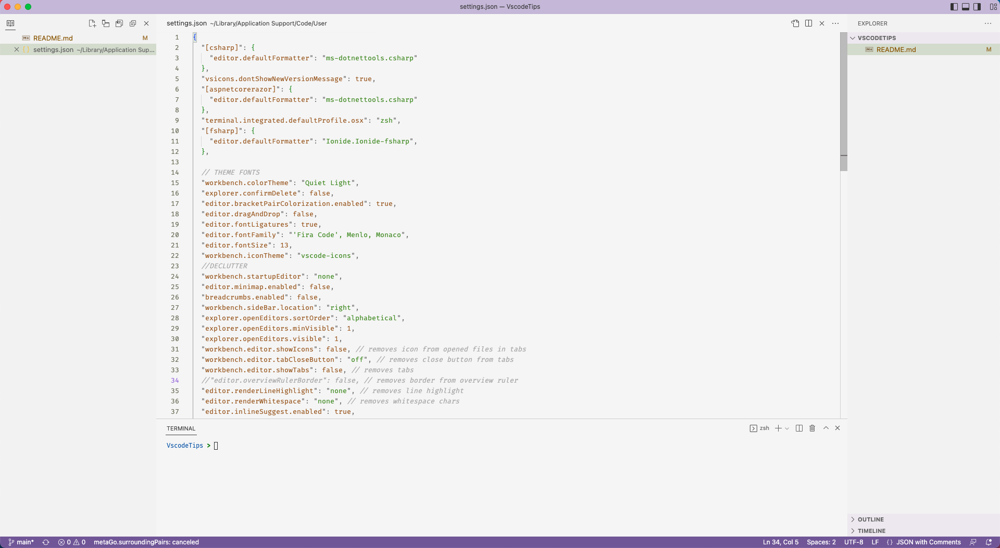

# How I Use Visual Studio Code?

Disclaimer: I'm not saying this is the best way. I'm even sure there are better ways, if you have improvements *let me know*!

This guide is mainly for me and people that ask me about my setup when pair programming

In all shortcut example **Alt = Option** on Mac

In most examples **Ctrl = Command** on Mac

## Workflow

I use terminal and ```cd``` command to navigate to repository and ```code .``` to launch everything in VSCode.

## VSCode GUI

I prefer Vertical Tabs over horizontal ones (I use Open Editors for that focus on it with ```Ctrl + K, E```), I like having the bar on the left side so the code starts a little bit more in the center of the screen. I have the main bar on the right, usually in File explorer and I hide it (```Ctrl + B```) when I need more space. I have a terminal open (```Ctrl + ` ```) almost all the time and I use it mainly for launching project from the command line and git CLI.

<!--  -->
TODO: add new screenshot

## Philosophy

I try to use keyboard as much as possible. Mouse is for the problems I don't know/remember how to solve quickly with keyboard.

Two shorcuts that I recommend are:
* ```Ctrl Shift P``` - Command Pallette, you can do most stuff with it
* ```Ctrl P``` - Search files by name

## Best shortcuts
* ```Alt ⬆️``` / ```Alt ⬇️``` - move the line/selection up/down
* ```Ctrl K  Ctrl C ``` - comment line/selection
* ```Ctrl K  Ctrl U ``` - uncomment line/selection
* ```Alt Shift ⬇️``` - copy line below
* ```Shift Del ``` or ```Ctrl Shift k``` - delete line
* ```Ctrl L``` - highlight line (can be chained)
* ```Ctrl Shift [```  **/**  ```Ctrl Shift ]``` - navigate to next / previous open editor

## Other useful shortcuts

* ```Ctrl .``` - definition window (still trying to find something better)

## Best extensions

* [Error Lens](https://marketplace.visualstudio.com/items?itemName=usernamehw.errorlens) - Never hover over an error/warning again
* [Peacock](https://marketplace.visualstudio.com/items?itemName=johnpapa.vscode-peacock) - If you are working with a couple of instances of VSCode at the same time this is a life saver, color code them for easier context switching

## Eyecandy extensions 
I don't rely on them very much but they make life a bit nicer
* [vscode-icons](https://marketplace.visualstudio.com/items?itemName=vscode-icons-team.vscode-icons)
* [Color Highlight](https://marketplace.visualstudio.com/items?itemName=naumovs.color-highlight)

## Extensions I'm trying out
* [bookmarks]()
* [excalidraw]()
* [shifter]()

## Extensions I've used but dropped since
* [Quick and Simple Text Selection](https://marketplace.visualstudio.com/items?itemName=dbankier.vscode-quick-select) - I use it for selecting stuff inside brackets ```CTRL K; <bracketType>```
* [Select Paragraph](https://github.com/nachocab/vscode-select-paragraph) - one keyboard shortcut for paragraph selection, extremely simple, extremely useful
* [Align by RegEx](https://marketplace.visualstudio.com/items?itemName=janjoerke.align-by-regex) - another simple but powerful one
* [Todo Tree](https://marketplace.visualstudio.com/items?itemName=Gruntfuggly.todo-tree)

## Fonts

* [Fira Code](https://github.com/tonsky/FiraCode) for text editor


## Themes
* Solarized Light with custom colors

## Deprecated Themes worth considering

I generally use **light theme** because I work in quite bright environment and it feels better for my eyes. I know I am in the [minority](https://css-tricks.com/poll-results-light-on-dark-is-preferred/) my default theme is **Quiet Light** (it comes preinstalled), but these are the ones I considered:

* Solarized Autumn
* Ysgrifennwr
* Brackets Light Pro
* Aofuji Light Theme
* Primer Light
* Nüshu
* Night Owl

## Settings declutter

```"workbench.startupEditor": "none",
  "editor.minimap.enabled": false,
  "breadcrumbs.enabled": false,
  "workbench.sideBar.location": "right",
  "explorer.openEditors.sortOrder": "alphabetical",
  "explorer.openEditors.minVisible": 1,
  "explorer.openEditors.visible": 1,
  "workbench.editor.showIcons": false, 
  "workbench.editor.tabCloseButton": "off",
  "workbench.editor.showTabs": false,
  "editor.renderLineHighlight": "none",
  "editor.renderWhitespace": "none",
  "editor.inlineSuggest.enabled": true,
  "workbench.activityBar.visible": false,
  "workbench.editor.enablePreview": false, 
  "workbench.activityBar.location": "hidden",
  "workbench.editor.tabActionCloseVisibility": false,
  "workbench.editor.editorActionsLocation": "hidden",
```
Also check [my settings json](settings.copy.json)

## What I also personally use:

* [Ionide](https://ionide.io/) for F# my favorite language

## Why not Neovim / Vim / Emacs ?

For emacs I'm too scared for my pinky ;) 
But the real reason VS Code gets extensions / language support the fastest and it feels stable and is getting better and better for C# which I mostly use.
I'm not good enough at Vim and I find hjkl to be too tricky (why it isn't modernized to ijkl or something?) and at some point I in this modern semi-AI era I feel like typing speed is not that big of a stopper. Vim bindings certainly makes it more fun to edit text and in the future I'll probably try them again, and again. :)

Checkout [my try for VIM in Vscode](vim.md) that I will probably reuse again, and again.